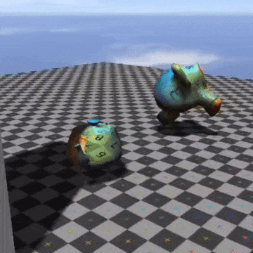

# LoveXYZ

LoveXYZ is a 3d engine developed by Zellicious.

Made for Love2D

#### Preview

----

## State of the engine

This version of LoveXYZ* is unstable and is not optimized.

This version is also pretty unfinished.

Will add more features and improve perf.

----

### Usage notes

* Supports simple triangle loading and obj model loading
* Supports simple shading (blinn-phong and shadow map shadows)
* You can cache textures and give them simpler names to use in other scripts

----

### Documentation

(soon)

----

#### Version 1.1.0
